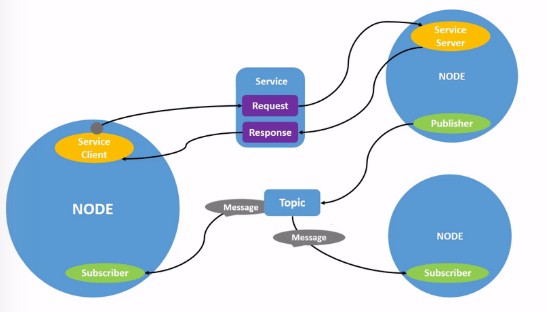
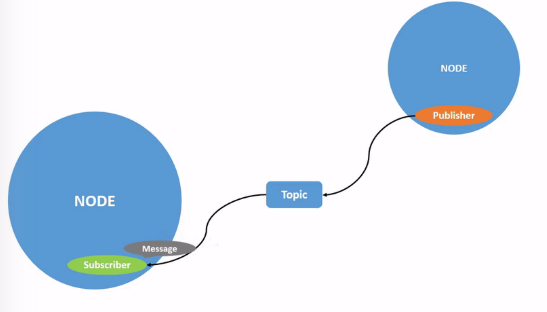
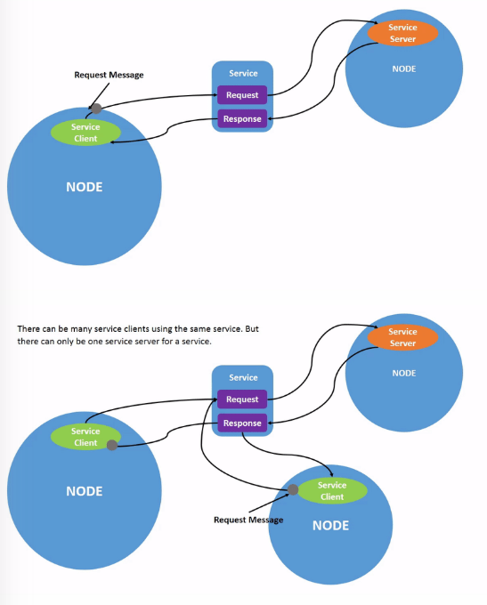
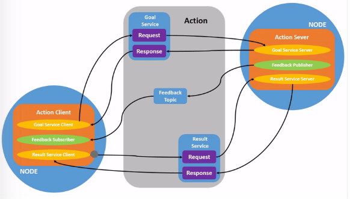
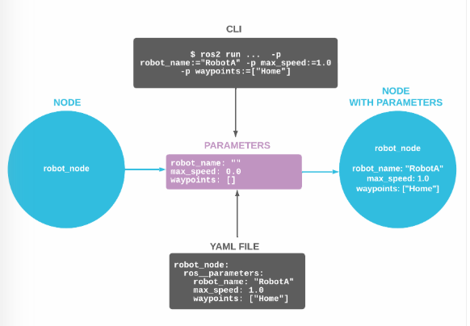
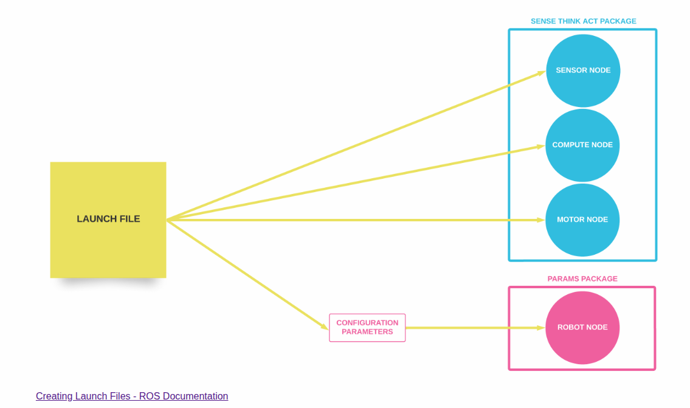
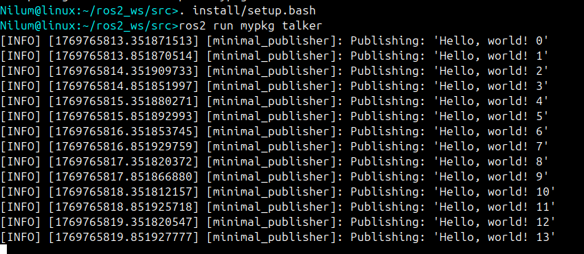

## This Repository includes my tutorial workspace in ROS2


# 🚀 ROS 2 Jazzy Workspace Setup

This repository documents how to set up and run a basic **ROS 2 Jazzy** workspace with `turtlesim`.

---

## 📂 1. Create your ROS workspace

```bash
mkdir -p ~/ros2_ws/src
cd ~/ros2_ws
```
## ⚙️ 2. Enable colcon autocompletion (recommended)

Add the following line to your bash configuration file:
```bash
echo "source /usr/share/colcon_argcomplete/hook/colcon-argcomplete.bash" >> ~/.bashrc
source ~/.bashrc
```
## 🛠️ 3. Build the workspace
Normal build:
```bash
colcon build

```
If you need to override an existing package (e.g., turtlesim):
```bash
colcon build --allow-overriding turtlesim


```
## 🔌 4. Source your workspace

Every time you open a new terminal, run:

    source ~/ros2_ws/install/setup.bash


(Optional but recommended: add this to your ~/.bashrc)

    echo "source ~/ros2_ws/install/setup.bash" >> ~/.bashrc

## 🐢 5. Run Turtlesim
    
    ros2 run turtlesim turtlesim_node

## Create your own package in ROS2
Preq:

    sudo apt install python3-colcon-common-extensions
    mkdir -p ~/ros2_ws/src
    cd ~/ros2_ws
Navigate to the src:

    cd ~/ros_ws/src
create package:

    ros2 pkg create --build-type ament_cmake --node-name <my_node> <my_pkg>
Build the package form ~/ros_ws:

    colcon build --packages-select my_package

Source:

    source install/local_setup.bash
Run the package:

    ros2 run <my_pkg> <my_node>

## ROS2 Node Introduction
Nodes are intracting eachother using  followings.
*   **Topics**: For cts data streaming(pub/sub)
*   **Services**: For quick reset-response interactions 
*   **Actions**: For long Running tasks with feedbacks 
*   **Parameters**: For changing configuration during the runtime 
* Nodes can communicate across processes or different machines 
* Node connections are stablished through a distributed Discovery process.
* A single node can simultanieously acts as a publisher, subscriber, server and client.


## ROS TOPICS: 


## ROS Services:


## ROS Actions:

## ROS parameters:

## Lunch File:


## Publisher and Subscriber in C++ 

1. Write the Publisher Node 
    ```
    wget -O publisher_lambda_function.cpp https://raw.githubusercontent.com/ros2/examples/jazzy/rclcpp/topics/minimal_publisher/lambda.cpp
    
    ```

    Ther will be a file named in ROS2_WS/src

    Add dependancies in CMakeLists.txt:

    ```
    <description>Examples of minimal publisher/subscriber using rclcpp</description>
    <maintainer email="you@email.com">Your Name</maintainer>
    <license>Apache-2.0</license>
    
    <depend>rclcpp</depend>
    <depend>std_msgs</depend>

    ```
    Finaly the CMakeLists.txt

    ```
    cmake_minimum_required(VERSION 3.5)
    project(cpp_pubsub)

    # Default to C++14
    if(NOT CMAKE_CXX_STANDARD)
    set(CMAKE_CXX_STANDARD 14)
    endif()

    if(CMAKE_COMPILER_IS_GNUCXX OR CMAKE_CXX_COMPILER_ID MATCHES "Clang")
    add_compile_options(-Wall -Wextra -Wpedantic)
    endif()

    find_package(ament_cmake REQUIRED)
    find_package(rclcpp REQUIRED)
    find_package(std_msgs REQUIRED)

    add_executable(talker src/publisher_lambda_function.cpp)
    ament_target_dependencies(talker rclcpp std_msgs)

    install(TARGETS
    talker
    DESTINATION lib/${PROJECT_NAME})

    ament_package()

    ```

2. Write the subscriber node 

<br> 

Return to the "ros2_ws/src/mypkg/src" to create the subscriber node 
<br>
```
wget -O subscriber_lambda_function.cpp https://raw.githubusercontent.com/ros2/examples/jazzy/rclcpp/topics/minimal_subscriber/lambda.cpp

```

<br>

Reopen CMakeLists.txt and add the executable and target for the subscriber node below the publisher’s entries.

<br>

```
    add_executable(listener src/subscriber_lambda_function.cpp)
    ament_target_dependencies(listener rclcpp std_msgs)

    install(TARGETS
    talker
    listener
    DESTINATION lib/${PROJECT_NAME})
```

## Build and Run 

<br>

go to the root and install the dependancies 

```
rosdep install -i --from-path src --rosdistro jazzy -y
```


## Run the package and you will see the output like this.

    

    