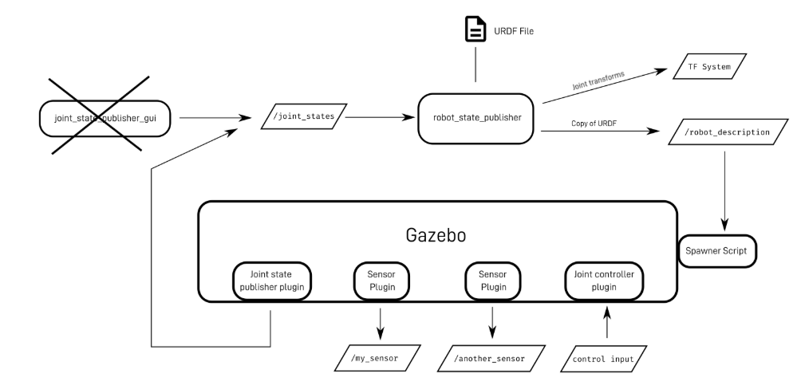

## Why Simulations?

This helps developers to validate robots behavior in virtual envs before using real physical hardware.

The most widely used simulator is **Gazebo**.

## Gazebo 
A full physics Simulator.
Gazebo is a physics-based robot simulation environment. It provides gravity, collisions, sensors (Lidar, Camera, IMU, etc.), and actuators. Gazebo allows safe testing of robot behavior before deployment to physical hardware.

* Gazebo Variants

1. Gazebo Classic: The original version (e.g., Gazebo 11), widely used in ROS 1 and early ROS 2.
2. Gazebo Sim (formerly Ignition Gazebo): The modern rewrite (e.g., Fortress, Garden, Harmonic). This is the current standard for ROS 2, featuring improved physics, rendering, and a modular plugin system.

## Robot Model 

This defines the individual entity structure using the SDF (Simulation Description Format).

This includes:

1. Kinematics - Hierarchy of "link" tag (rigid body) and joints (rotational and translation points)

2. Physical Dynamics - Mass, Center of Gravity and Inertial tensors 

3. Collision Geometry - Simplified shapes(boxes, cylinders) used by the physics engine to calculate the impact and friction, separate from the high detailed visual meshes.

## World 

This is the stage for the simulation,
Typically saved as a world file (top-level SDF) that manages:

1. Global Physics - gravity prams, magnetic fields, and solver constrains.

2. Env Assets - The ground plane, sky, sun(lighting), and static obstacles like buildings or terrain.

3. Model Inclusion - World acts as a container where multiple Robots are spawned and positioned.

## Sensors 

This is defined within the sensor tag of the model to provide data feedback.

1. Capabilities - Support Lidar, RGB/Depth Cameras, IMU and Contact Sensors.

2. ROS2 integration - In Gazebo sim , raw sensor data is typically passed to ros1 via a bridge (ros_gz_bridge) to be consumed by navigation or perception nodes.

## Actors 

These are dynamic entities used for env noise or human robot interaction testing.

1. Animation - use for animation (.dae or .fbx) to represents walking and waving 

2. Scripted motion - Actors followed predefined paths or waypoints.

## Plugins 

Plugins are C++ libraries that extend Gazebo's functionality by providing a bridge between the physics engine and external software.

1. Model Plugins - Essential for ROS 2; they listen for geometry_msgs/Twist commands to drive wheels or move joints.

2. System Plugins - Handle high-level tasks like logging data, controlling the GUI, or managing the simulation clock.

----------------------------------------------------------

 

