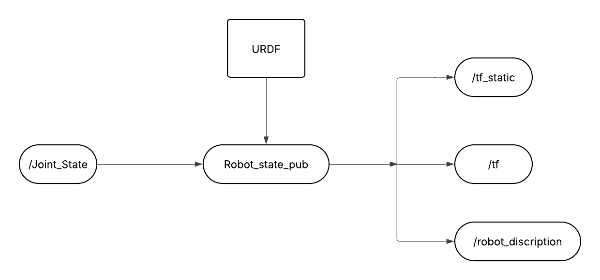
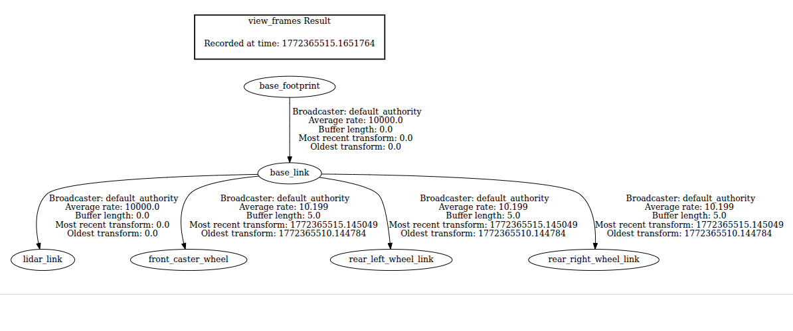
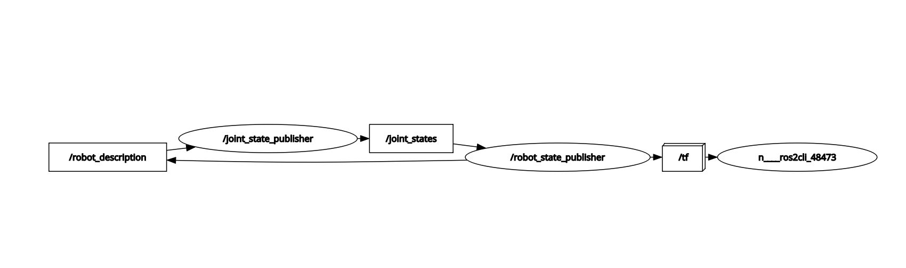

## Create urdf for the robot with Liadr


Commands:

View urdf in Rviz :

```
ros2 launch urdf_tutorial display.launch.py model:=<file path_to_urdf>
```

View frames:
```
ros2 run tf2_tools view_frames
```

This will generate a pdf of frame(Tree structure)


## Publish TFs using URDF and Robot State Publisher 



Steps:

1. Find the correct URDF file.
2. Install these packages:
    ```
    sudo apt install ros-<your_ros_dis>-state-publisher ros-<your_ros_dis>-xacro ros-<your_ros_dis>-joint-state-publisher-gui
    ```
3. Source the installation
```
source /opt/ros/<ros_dis>/setup.bash
```
4. start the robot state publisher first

```
ros2 run robot_state_publisher robot_state_publisher <path_to_URDF>

# give URDF as a parameter 
ros2 run robot_state_publisher robot_state_publisher --ros-args -p robot_description:="$(xacro path/to/urdf)"
```





