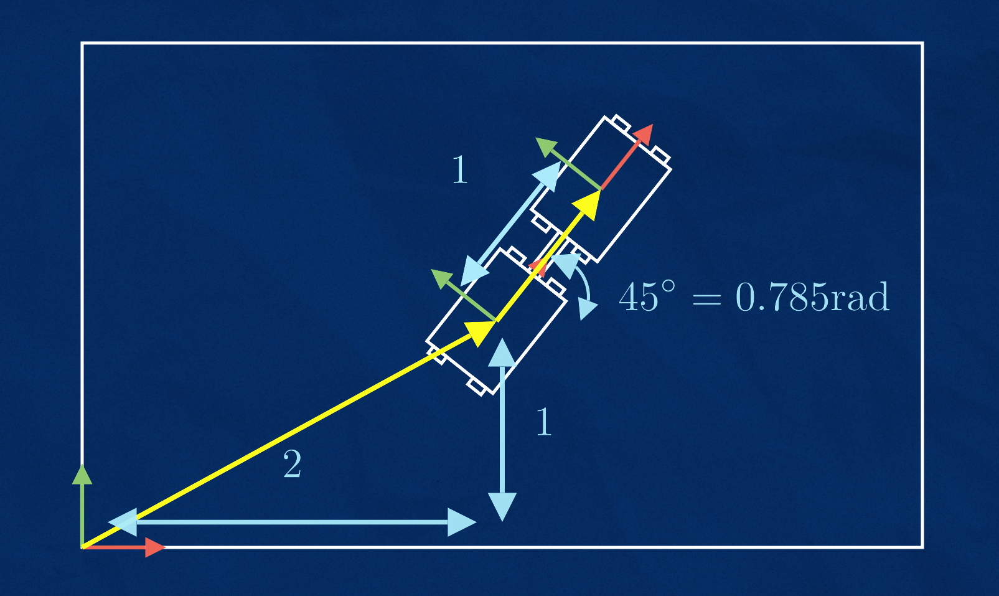
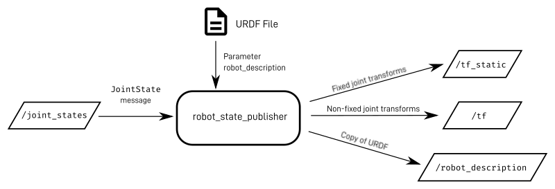

## ROS2 Visualize TF's - (Transform frame 02)

In ros2 there are many visualization tools. Here we are going to talk about Rviz user interface.


1. First install the urdf_tutorial pack :

```
sudo apt install ros-jazzy-urdf-tutorial
sudo apt update
source /opt/ros/jazzy/setup.bash

```

2. Then run : 
```
ros2 launch urdf_tutorial display.launch.py model:=urdf/03-origins.urdf

```

You can see the Rviz interface like this :
<br>


3. use tf tools 

```
ros2 run tf2_tools view_frames
```
Then It will wait for 5s and save the out put as a pdf following like this.


So there are 2 types of transforms 

    1. Static transforms
    2. Dynamic transforms 

Both above transforms use topics and massages to communicate.(Typically doing **Broadcasting** and **Listening**)

1. Broadcasting static transforms



No change in the frames. 

```
ros2 run tf2_ros static_transform_publisher x y z yaw pitch roll parent_frame child_frame
```

2. Broadcasting dynamic transforms 

We should install some packages here. 

```
sudo apt update
sudo apt install ros-jazzy-xacro ros-jazzy-joint-state-publisher-gui

```
we use the URDF file for this (config for robot geometry and physical size)

URDF------  (A tree)
         | ---- Links 
         | Connected BY 
         | ---- joints 

But TF is also connected like above tree style.

TF  ------  (A tree)
         | ---- Frames
         | Connected BY 
         | ---- Transforms 



This need external values. The joint state node take this parameters and send Joint state message to the robot state publisher. 

 we need to do is publish JointState messages. Normally, this data will come from actuator feedback sensors on the robot such as encoders or potentiometers (and in a simulation environment those can be simulated). For now, we will just fake the joint states using a tool called joint_state_publisher_gui. This node will look at the /robot_description topic published by robot_state_publisher, find any joints that can be moved, and display a slider for them. It reads the values from these sliders, and publishes them to /joint_states.

 


 Run the command:

 First run the robot state publisher 

 ```
 ros2 run robot_state_publisher robot_state_publisher --ros-args -p robot_description:=(something here)
 ```