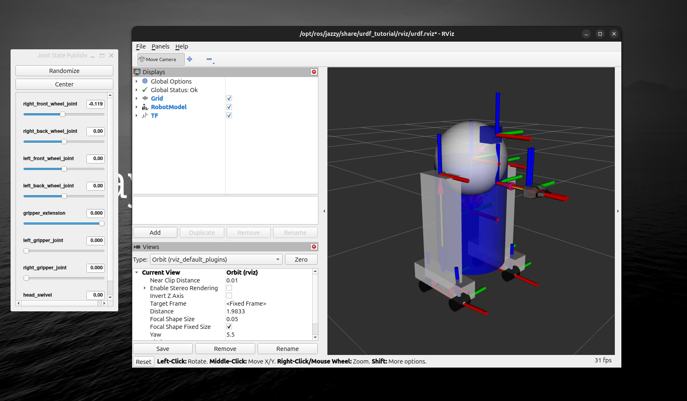
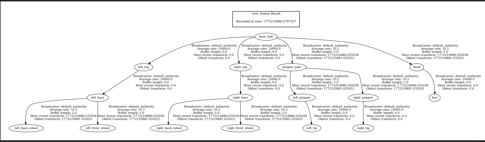

## ROS2 Visualize TFS 

In ros2 there are many visualizarion tools. Here we are going to talk about Rviz user interface.


1. First install the urdf_tutorial pack :

```
sudo apt install ros-jazzy-urdf-tutorial
sudo apt update
source /opt/ros/jazzy/setup.bash

```

2. Then run : 
```
ros2 launch urdf_tutorial display.launch.py model:=urdf/03-origins.urdf

```

You can see the Rviz interface like this :
<br>


3. use tf tools 

```
ros2 run tf2_tools view_frames
```
Then I will wait for 5s and save the out put as a pdf following like this.

