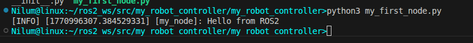
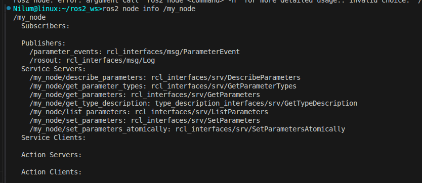
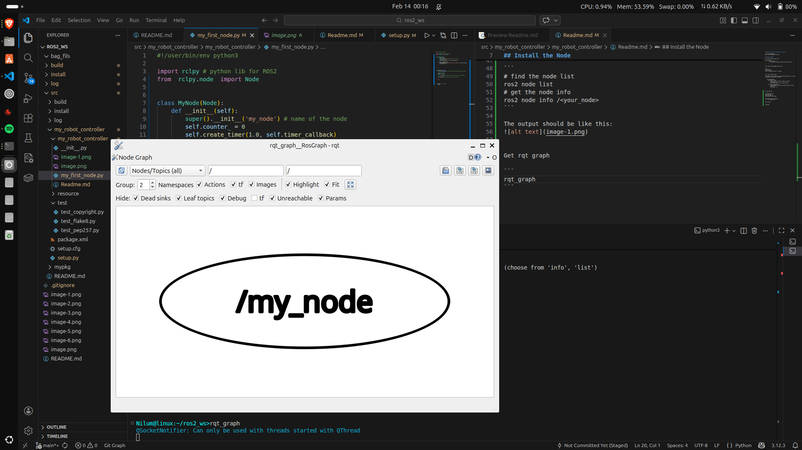
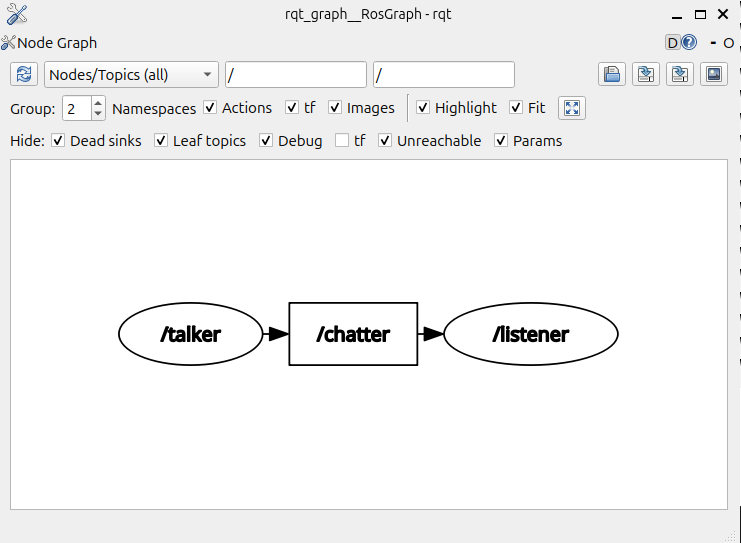
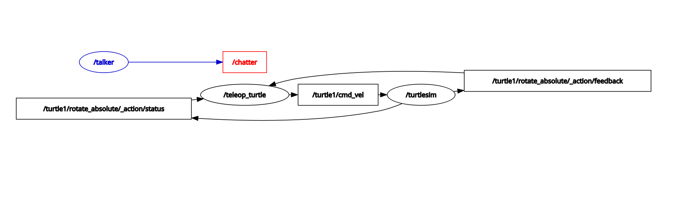
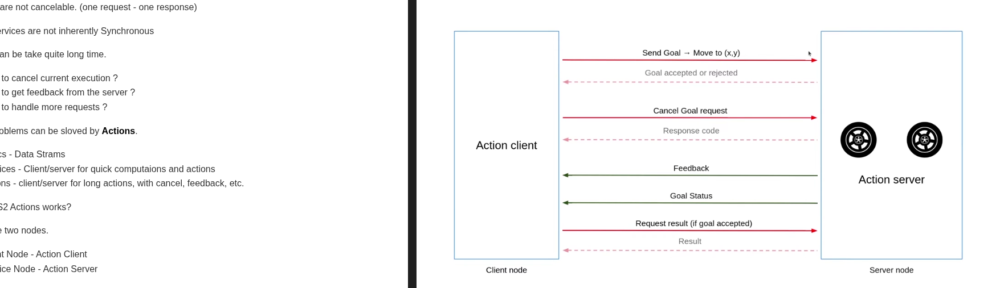

## After you run this the terminal looks like this. 


Note that this happen without spin


## Install the Node

Go to the setup.py and edit this : 
``` 
entry_points={
        'console_scripts': [
            'test_node = my_robot_controller.my_first_node:main'
        ]
```


After this build the pakage and source it.

```
cd ../..
colcon build 
source ~/.bashrc
ros2 run my_robot_controller  test_node
```


Set a timer inside the node 

The method is make a another function inside the Node and call it within create_timer function like in the code. 

```
    class MyNode(Node):
        def __init__(self):
            super().__init__('my_node') # name of the node
            self.counter_ = 0
            self.create_timer(1.0, self.timer_callback)

        def timer_callback(self):
            self.get_logger().info("Timer callback called"+ str(self.counter_))
            self.counter_ += 1
        
```


Get the node info 

```
# find the node list 
ros2 node list 
# get the node info 
ros2 node info /<your_node>
```

The output should be like this: 



Get rqt graph 

```
rqt_graph 
```




## Topics 


Run these following comands in a spearate terminals 

```
ros2 run demo_nodes_cpp talker 
ros2 run demo_nodes_cpp listener
```
Then get the rqt graph 
```
rqt_graph 
```

The terminal outputs looks like this :

The Talker:
```
[INFO] [1771043218.634701153] [talker]: Publishing: 'Hello World: 1'
[INFO] [1771043219.634702793] [talker]: Publishing: 'Hello World: 2'
[INFO] [1771043220.634752320] [talker]: Publishing: 'Hello World: 3'
[INFO] [1771043221.634748655] [talker]: Publishing: 'Hello World: 4'
[INFO] [1771043222.634695601] [talker]: Publishing: 'Hello World: 5'
[INFO] [1771043223.634700504] [talker]: Publishing: 'Hello World: 6'
[INFO] [1771043224.634696091] [talker]: Publishing: 'Hello World: 7'
[INFO] [1771043225.634648729] [talker]: Publishing: 'Hello World: 8'
[INFO] [1771043226.634766758] [talker]: Publishing: 'Hello World: 9'
[INFO] [1771043227.634741119] [talker]: Publishing: 'Hello World: 10'
[INFO] [1771043228.634730047] [talker]: Publishing: 'Hello World: 11'
[INFO] [1771043229.634650695] [talker]: Publishing: 'Hello World: 12'
```

The Listener :
```
[INFO] [1771043284.779178843] [listener]: I heard: [Hello World: 67]
[INFO] [1771043285.635046137] [listener]: I heard: [Hello World: 68]
[INFO] [1771043286.634899713] [listener]: I heard: [Hello World: 69]
[INFO] [1771043287.634845861] [listener]: I heard: [Hello World: 70]
[INFO] [1771043288.634956566] [listener]: I heard: [Hello World: 71]
[INFO] [1771043289.634992578] [listener]: I heard: [Hello World: 72]
[INFO] [1771043290.634957119] [listener]: I heard: [Hello World: 73]
[INFO] [1771043291.635020542] [listener]: I heard: [Hello World: 74]
[INFO] [1771043292.635085476] [listener]: I heard: [Hello World: 75]
[INFO] [1771043293.635109117] [listener]: I heard: [Hello World: 76]
[INFO] [1771043294.635067226] [listener]: I heard: [Hello World: 77]
[INFO] [1771043295.635077062] [listener]: I heard: [Hello World: 78]
[INFO] [1771043296.635029445] [listener]: I heard: [Hello World: 79]
[INFO] [1771043297.634884056] [listener]: I heard: [Hello World: 80]
[INFO] [1771043298.635001423] [listener]: I heard: [Hello World: 81]
[INFO] [1771043299.635006351] [listener]: I heard: [Hello World: 82]
[INFO] [1771043300.634991401] [listener]: I heard: [Hello World: 83]
[INFO] [1771043301.634978329] [listener]: I heard: [Hello World: 84]
[INFO] [1771043302.634993357] [listener]: I heard: [Hello World: 85]
```


The rqt_graph : 




The talker(pub) is publishing to the chatter(topic) and the listener(sub) is listening to the chatter. 


To get the ros2 topic list use this command :

```
>> ros2 topic list
/chatter
/parameter_events
/rosout 
```

Get the topic info :

```
>> ros2 topic info /chatter 
Type: std_msgs/msg/String
Publisher count: 1
Subscription count: 1
```
Type - what is being send


Get the interface :

```
>> ros2 interface show std_msgs/msg/String
# This was originally provided as an example message.
# It is deprecated as of Foxy
# It is recommended to create your own semantically meaningful message.
# However if you would like to continue using this please use the equivalent in example_msgs.

string data <-------------- This is the data type 
```

There will be many publishers and subscriber to a topic 

Run turtle sim and teleop and get the rqt graph. 



The topic is the cmd_vel and the teleop is publishing data to the topic and according to that turtle sim acts. 


## Services 

This is request response based(clinet-server based).
There will be a service client and service server.

get all the ros2 servives:

```
>>ros2 service list
/add_two_ints
/add_two_ints_server/describe_parameters
/add_two_ints_server/get_parameter_types
/add_two_ints_server/get_parameters
/add_two_ints_server/get_type_description
/add_two_ints_server/list_parameters
/add_two_ints_server/set_parameters
/add_two_ints_server/set_parameters_atomically
/clear
/kill
/reset
/spawn
/talker/describe_parameters
/talker/get_parameter_types
/talker/get_parameters
/talker/get_type_description
/talker/list_parameters
/talker/set_parameters
/talker/set_parameters_atomically
/teleop_turtle/describe_parameters
/teleop_turtle/get_parameter_types
/teleop_turtle/get_parameters
/teleop_turtle/get_type_description
/teleop_turtle/list_parameters
/teleop_turtle/set_parameters
/teleop_turtle/set_parameters_atomically
/turtle1/set_pen
/turtle1/teleport_absolute
/turtle1/teleport_relative
/turtlesim/describe_parameters
/turtlesim/get_parameter_types
/turtlesim/get_parameters
/turtlesim/get_type_description
/turtlesim/list_parameters
/turtlesim/set_parameters
/turtlesim/set_parameters_atomically
```

get the service info:

```
>>ros2 service info /add_two_ints
Type: example_interfaces/srv/AddTwoInts
Clients count: 0
Services count: 1
```

get the type :

```
>> ros2 service type /add_two_ints
example_interfaces/srv/AddTwoInts
```

Get the interface :
```
>>ros2 interface show example_interfaces/srv/AddTwoInts
int64 a
int64 b
---
int64 sum
```

Call the service :

```
ros2 service call <service> <service_type> <inputs>
```
call the add_two_ints service 
```
>>ros2 service call /add_two_ints example_interfaces/srv/AddTwoInts "{'a':2, 'b':5}"
waiting for service to become available...
requester: making request: example_interfaces.srv.AddTwoInts_Request(a=2, b=5)

response:
example_interfaces.srv.AddTwoInts_Response(sum=7)
```
The server terminal looks like this :
```
>> ros2 run demo_nodes_cpp add_two_ints_server
[INFO] [1771061193.256089857] [add_two_ints_server]: Incoming request
a: 2 b: 5
```
For Services there can be more clinets 

Change the settings in a service :
use tutrle sim set pen service 

get the service type :
```
>> ros2 service type /turtle1/set_pen
turtlesim/srv/SetPen
```
Get the interface :

```
>>ros2 interface show turtlesim/srv/SetPen
uint8 r
uint8 g
uint8 b
uint8 width
uint8 off
```

Call the service :

```
>>ros2 service call /turtle1/set_pen turtlesim/srv/SetPen "{'r':255, 'g':20 , 'b':30 }"
waiting for service to become available...
requester: making request: turtlesim.srv.SetPen_Request(r=255, g=20, b=30, width=0, off=0)

response:
turtlesim.srv.SetPen_Response()
```

## Actions 

Why Actions ?

First what are the communication Tools used in ROS?
    
    1. Topics  
    2. Services 

Something was missing ?

Services in ros2 are typically **Asynchronous** - Clients can send requests without blocking the execution. This none-blocking approach prevents node deadlocks, enables responsiveness.
Services are not cancelable. (one request - one response)

**Note** : Services are not inherently Synchronous

Actions can be take quite long time. 

1. How to cancel current execution ?
2. How to get feedback from the server ?
3. How to handle more requests ?

Above problems can be sloved by **Actions**. 

- Topics - Data Strams
- Services - Client/server for quick computaions and actions 
- Actions - client/server for long actions, with cancel, feedback, etc.

How ROS2 Actions works?

There are two nodes.

1. Client Node - Action Client
2. Service Node - Action Server 

First Action client sends a **Goal** to the Action server. The the Action server sends a massage wheather the Goal is accepted or rejected. If goal is accepted the Action server process the goal.
After goal is accepted, the Action client requests results. Then the Action server sends results to the action client.
Also Action client get feedback.




